# GF

> A world-first companion agent that keeps living when you are away.

GF 是一个面向长期陪伴场景的自主 Agent 实验项目。

它试图解决一个很简单的问题：

**如果一个角色不是在等待用户输入，而是真的拥有自己的世界、时间、经历和记忆，她与用户的关系会变成什么样？**

当前的第一个角色实例是《明日方舟》中的 **缪尔赛思**。

GF 目前处于架构验证和 runtime 实现阶段，还不是一个可直接使用的完整产品。

---

## Why GF

今天大多数陪伴型 AI 的基本运行方式仍然是：

```text
用户发消息
    ↓
读取角色 Prompt + 对话历史
    ↓
LLM 生成回复
    ↓
等待下一条消息
```

即使加入了 memory、emotion 或 proactive messaging，角色的世界通常仍然围绕用户输入运行。

GF 尝试换一个起点：

```text
                    ┌──── User message
                    │
World ── Events ────┼──── NPC / environment
                    │
                    └──── schedule / previous consequences
                              ↓
                         Perception
                              ↓
                    Memory / Belief / Commitment
                              ↓
                         Working Self
                              ↓
                         Open Policy
                              ↓
                          "I want to..."
                              ↓
                      World Adjudication
                              ↓
                     What actually happens
                              ↓
                       New World Events
                              ↺
```

**用户是她世界里非常重要的人，但不是让世界开始运转的按钮。**

当用户离开以后，时间仍然继续，过去的承诺仍然存在，NPC 和环境仍然可能发生变化，她之前做出的选择也可能在几个小时甚至几天后产生后果。

下一次聊天的内容，因此不只是模型临时编出来的一段背景故事，而应该来自这段时间里真正发生过的事情。

---

## Core ideas

### 1. World first

GF 的基本单位不是 conversation turn，而是 **WorldEvent**。

用户消息、时间变化、NPC 行动、环境变化和角色自己的行动结果进入同一条事件链。

因此：

```text
conversation ⊂ world
```

而不是：

```text
world ⊂ conversation
```

---

### 2. Knowing something is different from something being true

GF 把三个容易混在一起的东西分开：

- **Fact**：世界里实际发生过什么
- **Belief**：角色认为发生了什么
- **Commitment**：某次互动留下了什么承诺或义务

世界账本拥有事实权。

角色只能通过自己的感知和记忆接触世界，所以她可以不知道一件事、误解一件事，也可以和另一个角色对同一件事有不同理解。

这不是系统错误，而是长期主体性的一部分。

---

### 3. The LLM proposes. The world decides.

LLM 不能直接修改世界。

它可以产生开放的语义意图，例如：

> 我想先去 S-4 看一下培养情况，如果问题不严重，再赶回去完成下午答应的报告复核。

随后由 World Adjudicator 判断：

- 她现在在哪里？
- 时间够不够？
- 有没有需要的资源？
- 她是否具备对应能力？
- NPC 是否愿意配合？
- 世界规则允许吗？

最终结果可能是成功、失败、部分成功，或者产生新的代价。

```text
LLM
 │
 │ proposal
 ▼
Open Action
 │
 ▼
World Adjudicator
 │
 ▼
Actual Outcome
 │
 ▼
World Ledger
```

因此模型负责**意图与理解**，世界负责**事实**。

---

### 4. Memory should shape behavior without becoming a behavior tree

GF 不希望把人物设计成：

```text
遇到 X
→ 情绪 = Y
→ 选择行为 Z
```

长期经历首先保留为有来源的事件、记忆、信念和未完成事务。

当角色再次面对类似情境时，相关经历重新进入 Working Self，由模型在当下语境中重新理解。

目标不是制造一个越来越复杂的角色规则表，而是让行为从历史中产生。

---

### 5. Emotion changes attention, not decisions

GF 正在实验一套可拆卸的 Affect 系统。

它不是：

```text
anger = 0.8
→ choose aggressive_action
```

Affect 最多影响：

- 哪些经历此刻更显著
- 哪些记忆更容易被想起
- 注意力如何分配

它不能直接给动作打分，也不能替角色选择动作。

进入 LLM 上下文的仍然应该是她实际经历过的事情，而不是：

> current emotion = sad

Affect 可以完全关闭，因此它是否真的改善长期行为能够被实验验证，而不是成为不可移除的设定。

---

## Architecture

当前系统的核心边界可以简化为：

```text
                         WORLD
                           │
                    WorldEvent Ledger
                           │
                      Perception
                           │
             ┌─────────────┴─────────────┐
             │                           │
           Memory                      Belief
             │                           │
             └─────────────┬─────────────┘
                           │
                      Working Self
                           │
                       Open Policy
                           │
                    Open Action Intent
                           │
                    Action Compiler
                           │
                  World Adjudicator
                           │
                      StateManager
                           │
                ┌──────────┴──────────┐
                │                     │
             New Events             Outbox
                │                     │
                └─────── World ◄──────┘
```

几个关键约束：

- **Event Ledger** 保存客观历史
- **Perception** 决定角色实际能够知道什么
- **Working Self** 是一次认知所需上下文，不是真相数据库
- **LLM** 只能产生 proposal
- **World Adjudicator** 决定行动真正造成什么后果
- **StateManager** 是 authoritative state 的唯一提交入口
- 所有对外表达最终经过同一个 **Outbox**

完整架构约束见：

[`docs/invariants/19-architecture-invariants-v1.md`](docs/invariants/19-architecture-invariants-v1.md)



---

## Current status

GF 目前处于：

**architecture stabilized → runtime implementation**

已经存在：

- TypeScript runtime skeleton
- SQLite event/state persistence
- migration runner
- WorldEvent / claim / patch 等机器契约
- Prompt manifest 与 assembler
- CLI adapter
- gateway 与事件队列
- StateManager
- scheduler
- outbox 与恢复路径
- stub inference client
- canon corpus pipeline
- 基础契约与 runtime tests

正在完成：

```text
M1.1
runtime portability & correctness hardening
        ↓
M2.0
Perception
Memory / Commitment
Working Self
Open Policy
World Adjudicator
        ↓
M2.1
Independent world life
        ↓
M2.2
Shadow Affect
        ↓
M2.3
Active Affect validation
```

目前尚未实现完整的：

- subjective perception
- production memory retrieval
- general commitment cognition
- Working Self
- final Open Policy
- computable world adjudication
- autonomous NPC / environment loop
- production LLM provider
- active Affect

因此 **当前代码是用于验证架构的 runtime，而不是 finished companion agent**。

实时工程状态以 [`TODO.md`](TODO.md) 为准。

---

## Run the current runtime

Requirements:

- Node.js `>= 22.5`
- pnpm

安装依赖：

```bash
pnpm install
```

编译：

```bash
pnpm build
```

运行当前 CLI：

```bash
pnpm start
```

也可以执行 dry run：

```bash
node dist/gf/cli.js --dry-run 24 --advance-minutes 360
```

CLI 当前主要用于验证事件、状态、Prompt、scheduler 和 outbox 等 M1 runtime 行为。

它暂时使用 stub inference，并不代表最终产品体验。

---

## Repository guide

不需要从头阅读整个 `docs/`。

### 如果你第一次了解 GF

读：

1. **README.md** — 项目是什么
2. [`PROJECT-OVERVIEW.md`](PROJECT-OVERVIEW.md) — 更完整的产品与技术概览
3. [`world-interaction-structure-v1.svg`](world-interaction-structure-v1.svg) — 核心权责边界

### 如果你准备继续开发

读：

1. [`PROJECT-HANDOFF.md`](PROJECT-HANDOFF.md)
2. [`TODO.md`](TODO.md)
3. [`AGENTS.md`](AGENTS.md)

### 如果你准备修改架构

先读：

[`docs/invariants/19-architecture-invariants-v1.md`](docs/invariants/19-architecture-invariants-v1.md)

这里记录已经冻结的架构边界。

改变这些约束需要通过 ADR，而不是直接修改实现。

### 如果你想深入设计

[`docs/README.md`](docs/README.md) 是完整文档索引。

主要主题：

```text
docs/
├── invariants/   architecture constraints
├── product/      product / interaction / cross-world semantics
├── world/        computable world & adjudication
├── cognition/    memory / cognition / affect
├── character/    character instance
├── owner/        decisions requiring owner input
└── history/      retired designs and decision history
```

`docs/` 中的数字是稳定文档 ID，不代表阅读顺序。

---

## First character: Muelsyse

当前实验实例使用《明日方舟》角色 **缪尔赛思**。

角色实例层包括：

- canon corpus
- character seed
- dialogue references
- scenario-specific context
- cross-world interaction rules

但 GF 的 runtime 架构本身并不依赖缪尔赛思。

长期目标是让：

```text
Agent Runtime
     +
World Definition
     +
Character Seed
     +
Canon / Experience
```

构成一个可持续运行的角色实例。

---

## What GF is not

GF 目前不是：

- 一个通用聊天机器人框架
- 一个 Prompt-only roleplay bot
- 一个完整的《明日方舟》世界模拟器
- 一个已经可以部署给普通用户的产品
- 一个试图最大化用户聊天时长的 engagement system

它首先是一个问题的实验：

> **长期 AI 角色的行为，能不能主要从世界、经历、记忆和当下处境中产生，而不是从越来越长的角色规则里产生？**

---

## Project principles

GF 当前坚持几个底层原则：

**World over conversation.**  
世界不会因为用户离开而暂停。

**Evidence over invented continuity.**  
重要变化需要能够追溯到经历。

**Proposal over authority.**  
模型提出行动，但不能宣布行动已经成功。

**History over relationship scores.**  
关系来自共同经历，而不是一个 intimacy 数值。

**Open behavior over behavior trees.**  
不预先穷举角色应该怎样反应。

**Evaluation over assumption.**  
Affect 等复杂机制必须证明自己有价值，否则应该能够被关闭甚至删除。

---

## Documentation

完整文档导航：

[`docs/README.md`](docs/README.md)

当前任务：

[`TODO.md`](TODO.md)

项目交接：

[`PROJECT-HANDOFF.md`](PROJECT-HANDOFF.md)

架构冻结层：

[`docs/invariants/19-architecture-invariants-v1.md`](docs/invariants/19-architecture-invariants-v1.md)

---

## Disclaimer

GF is an independent research / fan project.

《明日方舟》及缪尔赛思相关角色、世界观与原始素材的权利归其各自权利人所有。本项目与官方无隶属关系。
