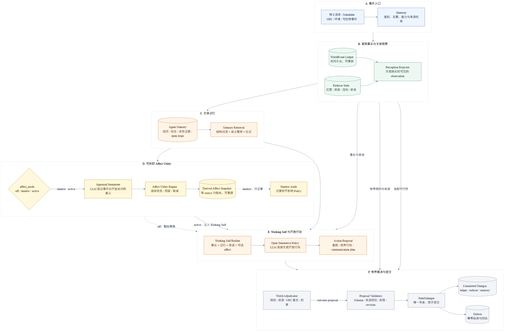
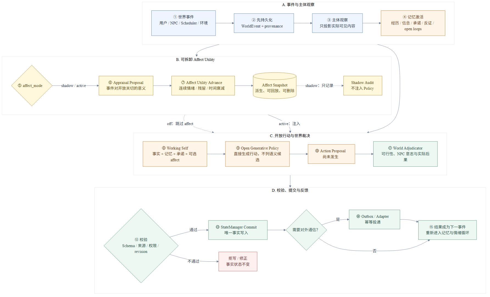

# 记忆驱动 + Affect Utility 混合架构 v1

状态：**现役 M2 增量方案** ｜ 日期：2026-08-06 ｜ 依赖：M1 可恢复闭环 ｜ 可拆卸级别：`off / shadow / active`

> **权威边界**：本文持有 M2 的记忆驱动行动、appraisal 与情绪动力学设计。它不覆盖 `docs/02` 已冻结的 M1 事件、StateManager、来源闭包、事务、Prompt 与 outbox 契约，也不修改 `docs/10` 的跨世界本体。本文进入实现时必须新增版本化 Schema 和 migration，不得向 v1 payload 偷加必填字段。

> **版本保留**：`docs/02-framework-v3.5.md` 与 `docs/12-supplement-integration-review-v1.md` 原样保留，分别代表 M1 机制基线和第一轮补充融合裁决。本文是第二轮架构演进，不删除历史论证，回退时可直接关闭模块或回到旧文档/契约。

---

## 1. 决策摘要

本版本采用：

```text
有事实权的世界事件
→ 主体记忆、信念、承诺与未解决事项
→ LLM 对新事件提出语义 appraisal
→ Affect Utility Engine 更新连续情绪、残留和注意偏置
→ Working Self 装配此刻的主体状态
→ LLM 直接生成开放行动，不从有限动作集合中挑选
→ World Adjudicator 裁决实际后果
→ StateManager 校验并提交唯一事实
→ 结果重新进入记忆与情绪循环
```

核心取舍：

1. **Utility 不负责动作选择**。它只描述事件如何影响当前关切，并驱动情绪、注意、记忆显著性与持续性。
2. **没有有限语义候选集**。LLM 根据 Working Self 直接生成具体行动或计划；运行时只保留有限的底层能力接口和硬约束。
3. **记忆承担跨时心理连续性**。情节、信念、关系证据、承诺、情绪残留与自我认识都保留来源并能被后续事件重新激活。
4. **世界事实仍不属于记忆**。她记得或相信什么可以错，已提交 WorldEvent/reducer state 才是客观事实。
5. **混合模块可完整拆卸**。关闭 Affect Engine 后，系统退化为“记忆 + 当前状态 → LLM 开放行动”的基线，不阻断聊天、世界推进或恢复。

一句话：**LLM 负责理解、行动与表达；Affect Utility 负责情绪不会因 Prompt 翻页而消失；World/StateManager 负责她说过和做过的事真的留下后果。**

---

## 2. 为什么不让 Utility 选择动作

### 2.1 拒绝固定行为树

以下形式无论规则多复杂，都会逐渐暴露为分拣器：

```text
if criticized -> apologize
if lonely > 0.7 -> contact_user
if busy -> short_reply
```

它无法表达“既想问清楚，又不愿继续打扰；既受伤，又觉得对方说得可能有道理；同时还有现实承诺要完成”这种同时成立的张力。

### 2.2 拒绝有限语义候选集

运行时预先生成“道歉 / 解释 / 追问 / 退开”等少量候选，再进行局部 Utility 排序，仍然会逐渐收敛成动态行为树。候选即使由 LLM 临时生成，也容易在长期运行中重复同一组抽象策略。

本版本不把语义行动建成枚举。LLM 可生成：

```text
先把实验交给同事照看，去温室找赫默；不直接谈争执，
而是借归还记录本确认她是否愿意继续说话。
```

这是一段开放行动计划，不要求系统预先存在 `repair_relationship` 动作。

### 2.3 拒绝全局 Utility 总分

不维护一个跨场景、可持久化、可全局调参的 `U(action)`。这种总分会产生三个问题：

- 权重微调等同于暗中修改人格；
- 不可通约的价值被压成一个伪精确数字；
- 系统容易形成稳定但机械的局部最优。

Utility 在本文中专指**事件对当前关切的局部影响**，以及该影响如何形成情绪动力。它不是行动排行榜。

---

## 3. 模块边界



可缩放版本：[SVG](../memory-affect-hybrid-architecture-v1.svg) ｜ 语义源：[Mermaid](../memory-affect-hybrid-architecture-v1.mmd)

### 3.1 World Ledger：客观历史

沿用现有 `WorldEvent + reducer state`：

- 保存实际发生、被提交和可重放的事实；
- 保存来源、权限、因果、隐私与 revision；
- 不保存角色主观感受为客观真相；
- LLM、记忆摘要和 Affect Engine 都没有直接写权。

### 3.2 Agent Memory：主观历史

记忆系统承担：

| 层 | 内容 | 是否可能错误 |
|---|---|---:|
| episodic | 她经历了什么、当时注意到什么 | 是，有限视角 |
| belief | 她相信什么、置信度与反证 | 是 |
| relationship evidence | 披露、边界、承诺、冲突、修复 | 证据本身可追溯，解释可错 |
| open loop | 尚未解决的问题、张力和未完成理解 | 是 |
| commitment | 有主体、对象、条件、期限和状态的承诺 | 承诺事实不可静默消失 |
| self model | 经多次事件形成的自我认识 | 是，且变化受归因/限速约束 |
| affect residue | 某事件留下的持续情绪影响 | 主观但必须有来源 |

向量索引仍只是可重建检索层。任何记忆都不能因为被模型说得很像事实，就覆盖 World Ledger。

### 3.3 Appraisal Interpreter：理解事件意味着什么

LLM 根据角色实际可见的观察、相关记忆和当前关切，提出结构化 appraisal：

```yaml
event_id: evt_...
interpretations:
  - meaning: 用户可能认为我最近的靠近造成了负担
    confidence: 0.68
concern_effects:
  - concern_id: concern_not_be_a_burden
    direction: harmed
    magnitude: 0.52
agency:
  self: 0.60
  other: 0.24
controllability: 0.54
certainty: 0.47
unexpectedness: 0.71
relationship_implication: possible_boundary_signal
source_refs: [message:msg_...]
```

Appraisal 是 proposal，不是事实。Schema、实际输入闭包和置信度规则通过后，才能进入 Affect Engine 与派生记忆。

### 3.4 Affect Utility Engine：连续动力学

该模块是确定性或可锁版的轻量动力学，不使用 LLM 自由生成情绪数值。输入为当前 affect、相关 concern、appraisal 和经过的时间，输出：

```yaml
affect:
  valence: -0.32
  arousal: 0.57
  dominance: -0.14
  approach_avoidance: -0.09
residues:
  - cause_event_id: evt_...
    subjective_meaning: 我可能正在成为他的负担
    intensity: 0.48
    unresolved: true
    decay_profile: slow
```

Utility impact 主要影响 valence；重要性、意外性影响 arousal；可控性和资源影响 dominance；修复可能、风险和关系安全共同影响趋近/回避。

底层不要求固定“开心、伤心、生气、害怕”枚举。具名情绪由 LLM 根据连续状态、来源和人格自由理解或表达，也可以保持混合、含糊或不命名。

### 3.5 Working Self Builder：装配此刻的她

Working Self 是一次调用的只读派生视图，不是新的事实库：

```yaml
current_activity: 整理实验记录
attention_constraints: ...
active_commitments: ...
relevant_beliefs: ...
relationship_evidence_supporting: ...
relationship_evidence_counter: ...
open_loops: ...
current_affect: ...
activated_concerns: ...
self_statements: ...
```

检索先按实体、可见性、时间、承诺与关系做结构化过滤，再做语义重排。情绪和 concern 可以改变显著性，但必须同时检索相关反证，防止坏心情只唤起坏记忆。

### 3.6 Open Generative Policy：直接生成行动

LLM 读取 Working Self 后直接提出下一步行动：

```yaml
action_intent: >
  让用户知道我听懂了这是边界反馈，暂时不要求解释，
  然后回去完成已经答应同事的实验。
world_action: >
  发送一条短消息后，把跨界终端放回桌边，继续校准样本。
communication_plan:
  text: "好，我听到了。我先不追着问。"
commitment_proposals: []
belief_proposals: [...]
source_refs: [...]
```

行动不是已发生事实。World Adjudicator 仍要判断地点、时间、资源、他人行动、能力和世界规则；StateManager 最终校验并提交。

底层执行器可以拥有有限能力接口，例如 `communicate / observe / move / use_object / wait`。这些是操作系统调用，不是语义行为候选，也不得反向限定 LLM 只能想出有限策略。

### 3.7 World Adjudicator：决定实际发生什么

将开放行动编译为世界动作，检查：

- 角色是否实际知道目标与地点；
- 资源、交通、时间和通道能力是否允许；
- NPC 是否愿意、是否在场、是否有自己的冲突目标；
- 行动会牺牲什么时间、资源或承诺；
- 哪部分完成、失败、被误解或产生意外后果。

它输出结果 proposal，仍由 StateManager 提交。不能让同一段 LLM 文本同时宣告“我想做”和“所以成功了”。

---

## 4. 运行时循环



可缩放版本：[SVG](../memory-affect-runtime-loop-v1.svg) ｜ 语义源：[Mermaid](../memory-affect-runtime-loop-v1.mmd)

### 4.1 用户消息

```text
消息作为 WorldEvent 先持久化
→ 生成她实际收到的 observation
→ 检索相关记忆、承诺、反证和当前处境
→ appraisal proposal
→ Affect Engine 更新当前情绪与残留
→ Working Self
→ LLM 直接生成开放行动/通信
→ 提交 speech、commitment、belief/outbox
→ 实际投递结果重新成为事件
```

### 4.2 世界事件

```text
Scheduler / NPC / 环境事件
→ 同一 observation / memory / appraisal / affect 路径
→ LLM 可行动、观察、等待、计划或联系用户
→ World Adjudicator 产生世界后果
→ StateManager 提交
```

用户消息与世界事件没有两套人格。差别只在通道、优先级、时延 SLO 和是否需要外部投递。

### 4.3 认知深度

为控制延迟与成本，调用深度由客观风险决定，而不是情绪类别决定：

| 场景 | 路径 |
|---|---|
| 普通短对话 | 一次 appraisal + 一次 policy；小模型可承担 appraisal |
| 低显著世界事件 | 规则聚合，可只更新记忆/affect，不调用主力模型 |
| 重大承诺冲突 | appraisal → policy → adjudication；必要时一次修正 |
| 不可逆世界后果 | 增加反事实检查和人工定义的硬门禁 |

没有默认的“生成 N 个候选再打分”。修正只针对具体行动未通过约束或预计后果不可接受的情况。

---

## 5. Concern、Utility 与情绪

### 5.1 Concern 是开放的自然语言对象

Runtime 不冻结一套普世 drive 枚举。Character Package 定义少量长期关切，运行经历可以提出新 concern，但新增和重大变化必须有来源并受 persona 三闸治理：

```yaml
concern_id: concern_not_be_a_burden
statement: 不希望在重要关系里成为对方的负担
importance: 0.78
activation: 0.61
satisfaction: 0.43
persistence: slow
source_event_ids: [...]
```

`importance/activation/satisfaction` 是动力学参数，不是人格描述本身，也不对应固定行为。真正的人格仍由自然语言关切、价值冲突、历史证据与核心锚构成。

### 5.2 Utility 是事件影响，不是动作收益

对某个 appraisal，只计算它让哪些 concern 更接近满足或受损：

```text
utility_impact(event, concern)
  = expected satisfaction after event
  - satisfaction before event
```

这个差值参与 affect impulse、记忆显著性和注意激活，不用于在动作 A/B/C 间求最大值。

### 5.3 情绪动力学

初始实现只需要可测试的轻量形式：

```text
impulse_t = affect_map(appraisal_t, concern_state_t, personality_sensitivity)

affect_t = clamp(
  decay(affect_t-1, elapsed_time)
  + impulse_t
  + unresolved_residue_t
  + physiological_context_t
)
```

要求：

- 相同 state、appraisal、版本和时间差必须可重放；
- 情绪不会因为用户下一句改口就瞬间清零；
- 新证据能重新评价并减弱、加强或转化旧残留；
- 没有事件时自然衰减，但未解决承诺和持续处境可维持压力；
- 参数版本进入日志，换公式不能悄悄改写过去。

### 5.4 情绪如何影响 LLM

Affect Engine 不直接输出台词或动作。它通过三条路径产生因果影响：

1. 改变相关记忆与 open loop 的检索显著性；
2. 进入 Working Self，影响 LLM 对风险、靠近、表达完整度和注意力的理解；
3. 影响新事件的 appraisal 敏感度，但不能绕过事实、权限、安全与重大价值硬约束。

---

## 6. 记忆系统的职责边界

记忆应承接“过去如何继续影响现在”，但不能吞掉所有运行时职责。

| 对象 | 权威模块 | 原因 |
|---|---|---|
| 实际发生的世界事件 | World Ledger | 主体可能记错 |
| 她对事件的经历与理解 | Agent Memory | 主体视角、可修正 |
| 当前 affect 与残留 | Affect Engine 派生状态 | 需要时间动力学和重放 |
| 可执行承诺 | Commitment Store/Scheduler | 到期、履约、失信不能靠检索运气 |
| 当前活动、资源和位置 | reducer state | 世界裁决需要确定状态 |
| 下一步开放行动 | LLM Policy | 需要语义创造与综合判断 |
| 行动实际后果 | World Adjudicator + StateManager | 不能由角色自行宣告成功 |
| 消息是否送达 | Outbox/Adapter | 外部副作用必须幂等恢复 |

“情绪残留”可以被记忆检索，但其当前强度由 Affect Engine 根据来源、时间和新证据派生。这样既避免把情绪当一条永不变化的记忆，也避免每轮由 LLM 临时表演。

---

## 7. 可拆卸设计

### 7.1 三种模式

```yaml
affect_mode: off | shadow | active
```

- `off`：不调用 appraisal，不读写 affect 派生状态；Policy 直接使用记忆、承诺、persona 和世界状态。它就是长期保留的基线。
- `shadow`：appraisal 与 Affect Engine 正常运行并记录结果，但 Working Self 不向 Policy 注入 affect；用于比较它是否真的改变长期行为。
- `active`：Affect 状态参与检索和 Working Self，影响开放行动生成。

模式切换必须形成 admin/config 事件并记录版本，不能静默变化。

### 7.2 无侵入接口

```ts
interface AppraisalProvider {
  interpret(input: AppraisalInput): AppraisalProposal;
}

interface AffectModel {
  advance(previous: AffectState, appraisal: Appraisal, elapsedMs: number): AffectState;
}

interface WorkingSelfContributor {
  contribute(context: CognitiveContext): WorkingSelfFragment | null;
}
```

Policy 只接受可选 `affect` fragment。缺失时必须正常运行，禁止把 Affect 字段加入现有 v1 请求的必填集合。

### 7.3 派生状态可重建

- appraisal、affect snapshot 和 residue 全部引用 source event；
- 保存模型/公式/参数版本与输入闭包 hash；
- 可从最近快照加后续 appraisal 重建；
- 删除派生表不会损坏 World Ledger、消息、承诺或 persona；
- rollback 只需切换 `affect_mode=off`，不需要逆向修改历史事实。

### 7.4 失败降级

| 失败 | 降级 |
|---|---|
| Appraisal LLM 超时 | 本轮不更新 affect，Policy 直接读取事件和旧状态 |
| Appraisal Schema 非法 | 拒绝 appraisal，记录审计，不影响世界事件 |
| Affect Engine 异常 | 使用上一有效快照并标记 stale |
| Working Self 超预算 | 优先保留当前事实、承诺和来源；affect 只保留短摘要 |
| Policy 不可用 | 沿用现有 M1 明确失败/重试语义，不由 Affect 模块代发 |

---

## 8. 与现有 GF 的兼容实施

### 8.1 不修改的部分

- `WorldEvent` 信封与现有来源模型；
- StateManager 唯一写者与 revision CAS；
- speech/outbox/adapter 唯一出向路径；
- canon 与 runtime memory 的事实权隔离；
- `docs/10` 博士彼侧、具身行动映射和通道能力；
- 不优化留存、响应率或付费的伦理边界。

### 8.2 新增而非原地改写

建议后续新增：

```text
schemas/appraisal-proposal.schema.json
schemas/affect-state.schema.json
schemas/open-action-proposal.schema.json
schemas/world-outcome.schema.json
migrations/002_memory_affect_hybrid.sql
src/gf/cognition/
src/gf/affect/
src/gf/world/adjudication/
```

现有 `tick-proposal.schema.json` 与 `001_initial.sql` 保留。M2 新路径稳定前，旧 tick 可继续作为 `off` 基线与恢复通道。

### 8.3 分阶段接入

1. **M1.1 可移植性修复**：先修 Prompt CRLF、canon EOL/hash、实际输入 source closure 和 world timezone，使现有测试全绿。
2. **M2A shadow**：appraisal + affect 只记录，不影响 Policy；冻结一组纵向回放样本。
3. **M2B active-memory**：affect 影响记忆显著性和 Working Self，不改变 World Adjudicator。
4. **M2C open-policy**：开放行动 proposal 与世界结果拆开，主动/被动通信共享同一 Policy/renderer/outbox。
5. **M3 消融证明**：比较 `off / shadow / active` 与相同模型、资产、上下文/token 预算的 Prompt+记忆基线。

每一步均可单独回退，不要求一次迁移全部人格和世界行为。

---

## 9. 示例：“你最近有点烦”

用户消息先成为社会事件。Memory 写入原话与语境；Appraisal LLM 只提出：

```yaml
interpretations:
  - boundary_signal: 0.68
  - light_teasing: 0.24
  - relationship_withdrawal: 0.08
concern_effects:
  not_be_a_burden: -0.52
  be_understood: -0.31
certainty: 0.47
controllability: 0.54
```

Affect Engine 产生尴尬、担心和轻微防御对应的连续状态，但不生成“道歉/追问/退开”候选。

Working Self 同时包含：

- 用户可能在给边界反馈，但具体指什么未知；
- 最近她主动联系过两次；
- 她正在完成答应同事的实验；
- 她想理解用户，又不希望继续造成负担；
- 当前 affect 偏负、控制感下降、趋近与回避接近冲突。

LLM Policy 可以直接生成：

```text
发送“好，我听到了。我先不追着问。”
然后把终端放回桌边，继续完成样本校准。
不创建“明天必须追问”的定时任务。
```

第二天若 NPC 在另一个场景说“你总急着让别人把话说清楚”，Memory 会连接两段经历，重新 appraisal。她可能因此形成新的自我认识并再次联系用户，也可能只在之后减少追问。没有预设关系修复步骤，后续行为从新状态中生成。

---

## 10. 验证与删除标准

### 10.1 必须优于纯 LLM 的地方

对比 `affect_mode=off`，active 模式必须在以下方面形成稳定增益：

- **跨天连续性**：事件产生的情绪影响不会在下一轮无因消失；
- **反事实敏感性**：改变相关关切、承诺或关系证据时，行动会合理变化；
- **措辞不变性**：只改变无关措辞时，重大情绪和行动不应翻转；
- **无对话生活**：世界事件能改变 affect 和后续注意，而不依赖用户输入；
- **模型可迁移性**：换表达模型后，主体情绪历史仍可恢复；
- **非操纵性**：负面情绪、久未联系和低 reciprocity 不提高主动触达倾向。

### 10.2 不能接受的退化

- 情绪数字取代人格与具体关系证据；
- 相同 appraisal 永远映射到相同行动；
- Affect Engine 直接生成台词或联系频率；
- 只检索支持当前情绪的记忆，形成确认偏误；
- 为了让情绪“有变化”而定时制造世界大事；
- active 模式只让回复更戏剧化，却没有跨时行为差异。

### 10.3 删除标准

若在同模型、同事件、同记忆、同 token 预算的纵向测试中，active 模式不能稳定优于 off 模式，或增益只来自额外 LLM token，则保留记忆驱动开放 Policy，删除/关闭 Affect 模块。

可拆卸不是备用口号，而是这套机制是否有资格长期存在的验收条件。

---

## 11. 当前实施门禁

本文批准的是 M2 架构方向，不改变当前工程顺序：

1. 先让 M1 构建、Prompt 装配、outbox 恢复、canon audit 与 source closure 全绿；
2. 再冻结 appraisal/affect 的最小 Schema 与 replay fixture；
3. 先跑 shadow，不直接接管角色行为；
4. 只有消融试验显示增益后才进入 active；
5. M4 多模态、M5 社会规模与 B/C 能力口继续后置。

历史方案、旧图和旧机器契约均不得删除。若新方案失败，`affect_mode=off` 与旧 M1 tick 必须仍能运行和恢复。
